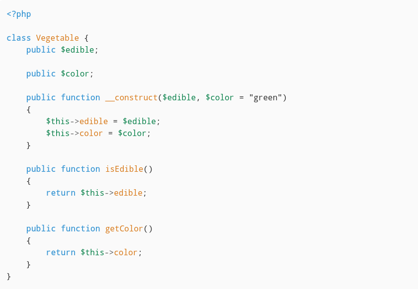

# Highlighter

A teeny-tiny PHP syntax highlighter. Uses `token_get_all()` to convert the PHP code you provide into PHP language tokens, and then renders those tokens into HTML using either the default styles or the ones you set.

For example, the following PHP:
```php
<?php

class Vegetable {
    public $edible;

    public $color;

    public function __construct($edible, $color = "green")
    {
        $this->edible = $edible;
        $this->color = $color;
    }

    public function isEdible()
    {
        return $this->edible;
    }

    public function getColor()
    {
        return $this->color;
    }
}
```

will result in the following HTML:
```html
<pre><code><span style="color: #3A97D4; font-weight: bold;">&lt;?php
</span><span style="color: #09814A; font-weight: bold;">
</span><span style="color: #3A97D4; font-weight: bold;">class</span><span style="color: #09814A; font-weight: bold;"> </span><span style="color: #D87A1A">Vegetable</span><span style="color: #09814A; font-weight: bold;"> </span><span style="color: #333;">{</span><span style="color: #09814A; font-weight: bold;">
    </span><span style="color: #3A97D4; font-weight: bold;">public</span><span style="color: #09814A; font-weight: bold;"> </span><span style="color: #09814A">$edible</span><span style="color: #333;">;</span><span style="color: #09814A; font-weight: bold;">

    </span><span style="color: #3A97D4; font-weight: bold;">public</span><span style="color: #09814A; font-weight: bold;"> </span><span style="color: #09814A">$color</span><span style="color: #333;">;</span><span style="color: #09814A; font-weight: bold;">

    </span><span style="color: #3A97D4; font-weight: bold;">public</span><span style="color: #09814A; font-weight: bold;"> </span><span style="color: #3A97D4; font-weight: bold;">function</span><span style="color: #09814A; font-weight: bold;"> </span><span style="color: #D87A1A">__construct</span><span style="color: #333;">(</span><span style="color: #09814A">$edible</span><span style="color: #333;">,</span><span style="color: #09814A; font-weight: bold;"> </span><span style="color: #09814A">$color</span><span style="color: #09814A; font-weight: bold;"> </span><span style="color: #333;">=</span><span style="color: #09814A; font-weight: bold;"> </span><span style="color: #333">&quot;green&quot;</span><span style="color: #333;">)</span><span style="color: #09814A; font-weight: bold;">
    </span><span style="color: #333;">{</span><span style="color: #09814A; font-weight: bold;">
        </span><span style="color: #09814A">$this</span><span style="color: #666">-&gt;</span><span style="color: #D87A1A">edible</span><span style="color: #09814A; font-weight: bold;"> </span><span style="color: #333;">=</span><span style="color: #09814A; font-weight: bold;"> </span><span style="color: #09814A">$edible</span><span style="color: #333;">;</span><span style="color: #09814A; font-weight: bold;">
        </span><span style="color: #09814A">$this</span><span style="color: #666">-&gt;</span><span style="color: #D87A1A">color</span><span style="color: #09814A; font-weight: bold;"> </span><span style="color: #333;">=</span><span style="color: #09814A; font-weight: bold;"> </span><span style="color: #09814A">$color</span><span style="color: #333;">;</span><span style="color: #09814A; font-weight: bold;">
    </span><span style="color: #333;">}</span><span style="color: #09814A; font-weight: bold;">

    </span><span style="color: #3A97D4; font-weight: bold;">public</span><span style="color: #09814A; font-weight: bold;"> </span><span style="color: #3A97D4; font-weight: bold;">function</span><span style="color: #09814A; font-weight: bold;"> </span><span style="color: #D87A1A">isEdible</span><span style="color: #333;">(</span><span style="color: #333;">)</span><span style="color: #09814A; font-weight: bold;">
    </span><span style="color: #333;">{</span><span style="color: #09814A; font-weight: bold;">
        </span><span style="color: #3A97D4; font-weight: bold;">return</span><span style="color: #09814A; font-weight: bold;"> </span><span style="color: #09814A">$this</span><span style="color: #666">-&gt;</span><span style="color: #D87A1A">edible</span><span style="color: #333;">;</span><span style="color: #09814A; font-weight: bold;">
    </span><span style="color: #333;">}</span><span style="color: #09814A; font-weight: bold;">

    </span><span style="color: #3A97D4; font-weight: bold;">public</span><span style="color: #09814A; font-weight: bold;"> </span><span style="color: #3A97D4; font-weight: bold;">function</span><span style="color: #09814A; font-weight: bold;"> </span><span style="color: #D87A1A">getColor</span><span style="color: #333;">(</span><span style="color: #333;">)</span><span style="color: #09814A; font-weight: bold;">
    </span><span style="color: #333;">{</span><span style="color: #09814A; font-weight: bold;">
        </span><span style="color: #3A97D4; font-weight: bold;">return</span><span style="color: #09814A; font-weight: bold;"> </span><span style="color: #09814A">$this</span><span style="color: #666">-&gt;</span><span style="color: #D87A1A">color</span><span style="color: #333;">;</span><span style="color: #09814A; font-weight: bold;">
    </span><span style="color: #333;">}</span><span style="color: #09814A; font-weight: bold;">
</span><span style="color: #333;">}</span></code></pre>
```

which will look a little something like this, when rendered in a browser:



You can customize it by passing your own style map and/or token map, see [the Highlighter class](src/Highlighter.php) for an example of both.

I know this method doesn't support dark modes, but I could easily change the style tag to a class and then it would. This just fits my current needs. I might switch to the class based approach later.