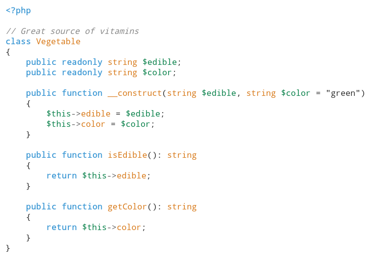

# Highlighter

A teeny-tiny PHP syntax highlighter. Uses `PhpToken` to convert PHP code into PHP language tokens, and then renders those tokens as HTML using either the default styles or custom ones you provide.

## Usage
Vegetable.php
```php
<?php

// Great source of vitamins
class Vegetable
{
    public readonly string $edible;
    public readonly string $color;

    public function __construct(string $edible, string $color = "green")
    {
        $this->edible = $edible;
        $this->color = $color;
    }

    public function isEdible(): string
    {
        return $this->edible;
    }

    public function getColor(): string
    {
        return $this->color;
    }
}
```
Using the following code:
```php
$input = file_get_contents('Vegetable.php');
$html = new Highlighter()->render($input);
echo $html;
```
results in the following HTML:
```html
<pre><code><span style="color: #3A97D4; font-weight: bold;">&lt;?php<br></span><span style="color: #09814A; font-weight: bold;"><br></span><span style="color: #888; font-style: italic;">// Great source of vitamins</span><span style="color: #09814A; font-weight: bold;"><br></span><span style="color: #3A97D4; font-weight: bold;">class</span><span style="color: #09814A; font-weight: bold;"> </span><span style="color: #D87A1A">Vegetable</span><span style="color: #09814A; font-weight: bold;"><br></span><span style="color: #333;">{</span><span style="color: #09814A; font-weight: bold;"><br>    </span><span style="color: #3A97D4; font-weight: bold;">public</span><span style="color: #09814A; font-weight: bold;"> </span><span style="color: #3A97D4; font-weight: bold;">readonly</span><span style="color: #09814A; font-weight: bold;"> </span><span style="color: #D87A1A">string</span><span style="color: #09814A; font-weight: bold;"> </span><span style="color: #09814A">$edible</span><span style="color: #333;">;</span><span style="color: #09814A; font-weight: bold;"><br>    </span><span style="color: #3A97D4; font-weight: bold;">public</span><span style="color: #09814A; font-weight: bold;"> </span><span style="color: #3A97D4; font-weight: bold;">readonly</span><span style="color: #09814A; font-weight: bold;"> </span><span style="color: #D87A1A">string</span><span style="color: #09814A; font-weight: bold;"> </span><span style="color: #09814A">$color</span><span style="color: #333;">;</span><span style="color: #09814A; font-weight: bold;"><br><br>    </span><span style="color: #3A97D4; font-weight: bold;">public</span><span style="color: #09814A; font-weight: bold;"> </span><span style="color: #3A97D4; font-weight: bold;">function</span><span style="color: #09814A; font-weight: bold;"> </span><span style="color: #D87A1A">__construct</span><span style="color: #333;">(</span><span style="color: #D87A1A">string</span><span style="color: #09814A; font-weight: bold;"> </span><span style="color: #09814A">$edible</span><span style="color: #333;">,</span><span style="color: #09814A; font-weight: bold;"> </span><span style="color: #D87A1A">string</span><span style="color: #09814A; font-weight: bold;"> </span><span style="color: #09814A">$color</span><span style="color: #09814A; font-weight: bold;"> </span><span style="color: #333;">=</span><span style="color: #09814A; font-weight: bold;"> </span><span style="color: #333">&quot;green&quot;</span><span style="color: #333;">)</span><span style="color: #09814A; font-weight: bold;"><br>    </span><span style="color: #333;">{</span><span style="color: #09814A; font-weight: bold;"><br>        </span><span style="color: #09814A">$this</span><span style="color: #666">-&gt;</span><span style="color: #D87A1A">edible</span><span style="color: #09814A; font-weight: bold;"> </span><span style="color: #333;">=</span><span style="color: #09814A; font-weight: bold;"> </span><span style="color: #09814A">$edible</span><span style="color: #333;">;</span><span style="color: #09814A; font-weight: bold;"><br>        </span><span style="color: #09814A">$this</span><span style="color: #666">-&gt;</span><span style="color: #D87A1A">color</span><span style="color: #09814A; font-weight: bold;"> </span><span style="color: #333;">=</span><span style="color: #09814A; font-weight: bold;"> </span><span style="color: #09814A">$color</span><span style="color: #333;">;</span><span style="color: #09814A; font-weight: bold;"><br>    </span><span style="color: #333;">}</span><span style="color: #09814A; font-weight: bold;"><br><br>    </span><span style="color: #3A97D4; font-weight: bold;">public</span><span style="color: #09814A; font-weight: bold;"> </span><span style="color: #3A97D4; font-weight: bold;">function</span><span style="color: #09814A; font-weight: bold;"> </span><span style="color: #D87A1A">isEdible</span><span style="color: #333;">(</span><span style="color: #333;">)</span><span style="color: #333;">:</span><span style="color: #09814A; font-weight: bold;"> </span><span style="color: #D87A1A">string</span><span style="color: #09814A; font-weight: bold;"><br>    </span><span style="color: #333;">{</span><span style="color: #09814A; font-weight: bold;"><br>        </span><span style="color: #3A97D4; font-weight: bold;">return</span><span style="color: #09814A; font-weight: bold;"> </span><span style="color: #09814A">$this</span><span style="color: #666">-&gt;</span><span style="color: #D87A1A">edible</span><span style="color: #333;">;</span><span style="color: #09814A; font-weight: bold;"><br>    </span><span style="color: #333;">}</span><span style="color: #09814A; font-weight: bold;"><br><br>    </span><span style="color: #3A97D4; font-weight: bold;">public</span><span style="color: #09814A; font-weight: bold;"> </span><span style="color: #3A97D4; font-weight: bold;">function</span><span style="color: #09814A; font-weight: bold;"> </span><span style="color: #D87A1A">getColor</span><span style="color: #333;">(</span><span style="color: #333;">)</span><span style="color: #333;">:</span><span style="color: #09814A; font-weight: bold;"> </span><span style="color: #D87A1A">string</span><span style="color: #09814A; font-weight: bold;"><br>    </span><span style="color: #333;">{</span><span style="color: #09814A; font-weight: bold;"><br>        </span><span style="color: #3A97D4; font-weight: bold;">return</span><span style="color: #09814A; font-weight: bold;"> </span><span style="color: #09814A">$this</span><span style="color: #666">-&gt;</span><span style="color: #D87A1A">color</span><span style="color: #333;">;</span><span style="color: #09814A; font-weight: bold;"><br>    </span><span style="color: #333;">}</span><span style="color: #09814A; font-weight: bold;"><br></span><span style="color: #333;">}</span></code></pre>
```
Each piece of the PHP code is rendered as an HTML `<span>` tag with inline styles applied to it. Special characters like quotes are converted into HTML entities and line breaks are rendered as `<br>` tags.

When rendered in a browser, the HTML will look like this:



## Custom styles
The highlighting is 100% customizable. 

Internally, the `Highlighter` class uses a token map and a style map. You can pass both to the constructor of the class and override the defaults. Your token map should contain PHP token codes (e.g. T_OPEN_TAG), grouped together using a keyword. Your style map should map CSS styles to the keywords you chose for your token map.

```php
// If you enter the following token map
$tokenMap = [
    'foobar' => [
        T_STRING, // identifiers, e.g. keywords like parent and self, function names, class names and more
        T_CALLABLE, // any callable,
    ]
];

// Your style map has to contain styles for that keyword
$styleMap  = [
    'foobar' => 'color: #3A97D4; font-weight: bold;',
];
```
See [the PHP docs](https://www.php.net/manual/en/tokens.php) for a list of all possible parser tokens.